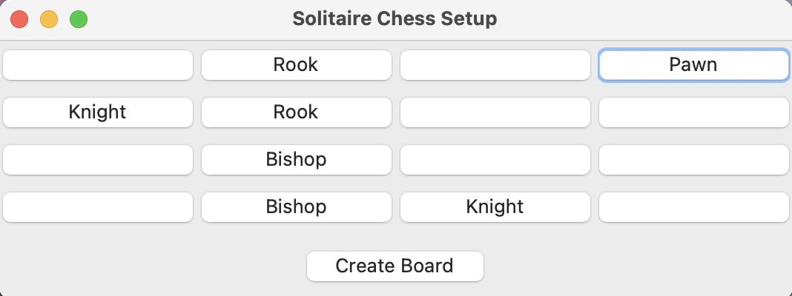
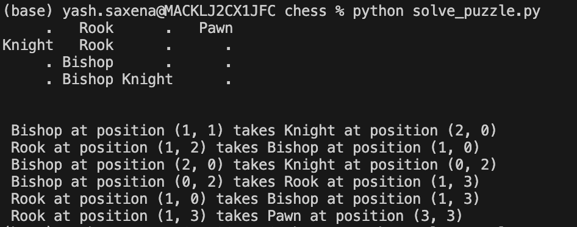

### Chess Solitaire Solver

Chess solitaire is a variant of chess that occurs on a 4x4 board. It's a single player game that requires players to determine the correct sequence of capturing moves that results in only one piece left on the board at the end.

#### Rules of the Game

Given a 4x4 board containing some chess pieces, find a sequence of captures such that there is only one piece left at the end. To be more specific, here are the rules:

1) You are provided a 4 x 4 board of chess pieces. 
2) All pieces can capture each other. Unlike traditional chess, all pieces are of the same color and can capture each other.
3) Every move must be a capture. In other words, each move should involve one of the pieces on the board capturing another piece on the board.
4) The puzzle has been solved if there is only one piece left on the board.

#### Files

* `pieces.py`: Defines the piece movement
* `solve_puzzle.py`: Does the DFS to solve the puzzle
* `tests.py`: Contains unit tests
